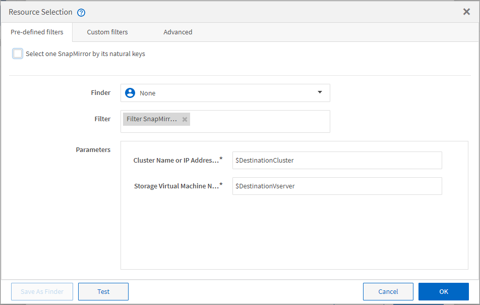

= 资源选择的工作原理
:allow-uri-read: 
:icons: font
:imagesdir: ../media/

[role="lead"]
OnCommand Workflow Automation （ WFA ）使用搜索算法选择存储资源以执行工作流。为了高效设计工作流，您应了解资源选择的工作原理。

WFA 使用搜索算法选择词典条目资源，例如 vFiler 单元，聚合和虚拟机。然后，将使用选定资源执行此工作流。WFA 搜索算法是 WFA 组件的一部分，其中包括查找器和筛选器。要查找并选择所需资源，搜索算法将搜索从不同存储库缓存的数据，例如 Active IQ Unified Manager ， VMware vCenter Server 和数据库。默认情况下，每个词典条目都有一个筛选器，用于根据资源的自然键搜索资源。

您应为工作流中的每个命令定义资源选择标准。此外，您还可以使用查找器在工作流的每一行中定义资源选择条件。例如，当您创建的卷需要特定的存储空间量时，您可以在 "`Create Volume` " 命令中使用 "`Find aggregate by Available Capacity` " 查找器，该查找器可选择具有特定可用空间量的聚合并在其中创建卷。

您可以为词典条目资源（例如 vFiler 单元，聚合和虚拟机）定义一组筛选规则。筛选器规则可以包含一组或多组规则。规则由词典条目属性，运算符和值组成。此属性还可以包括其引用的属性。例如，您可以按如下所示为聚合指定一个规则：列出名称以字符串 "`aggr` " 开头且可用空间超过 5 GB 的所有聚合。组中的第一个规则是属性 "`name` " ，运算符为 " `start-with` " ，值为 "`aggr` " 。同一组的第二条规则是属性 "`available_size_mb` " ，运算符为 "` >` " ，值为 "`5000` " 。您可以定义一组筛选器规则以及公有 筛选器。如果选择了查找器，则会禁用定义筛选器规则选项。如果选中了定义筛选器规则复选框，则保存为查找器选项将被禁用。

除了筛选器和查找器之外，您还可以使用 search 或 define 命令搜索可用资源。与 No-op 命令相比，搜索或定义命令是首选选项。搜索和定义命令可用于定义经过认证的词典条目类型和自定义词典条目类型的资源。search 或 define 命令会搜索资源，但不会对资源执行任何操作。但是，使用查找器搜索资源时，会在命令上下文中使用该查找器，并对资源执行命令定义的操作。由 search 或 define 命令返回的资源将用作工作流中其他命令的变量。

下图显示了一个筛选器用于资源选择：

== 预定义工作流中的资源选择示例

您可以在设计器中打开以下预定义工作流的命令详细信息，以了解如何使用资源选择选项：

* 创建集群模式 Data ONTAP NFS 卷
* 建立集群对等关系
* 删除集群模式 Data ONTAP 卷

