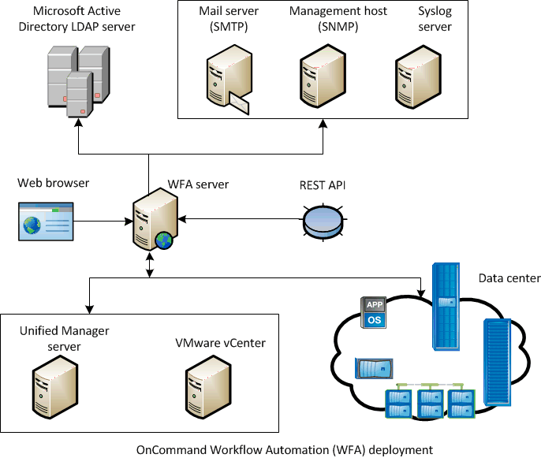

= OnCommand Workflow Automation 部署架构
:allow-uri-read: 
:icons: font
:imagesdir: ../media/

[role="lead"]
安装了 OnCommand Workflow Automation （ WFA ）服务器，以便在多个数据中心之间协调工作流操作。

通过将 WFA 服务器连接到多个 Active IQ Unified Manager 部署和 VMware vCenter ，您可以集中管理自动化环境。

下图显示了一个部署示例：

