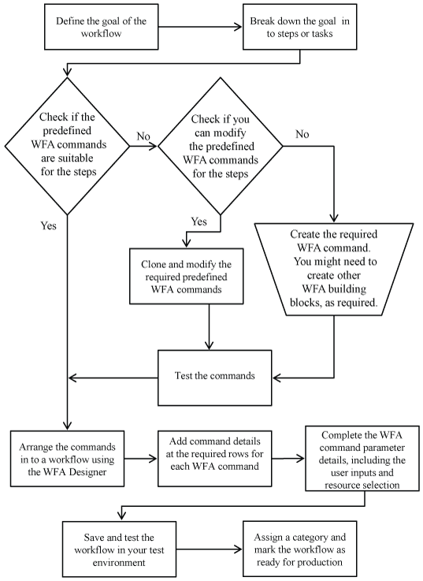

= 创建工作流所涉及的任务
:allow-uri-read: 
:icons: font
:imagesdir: ../media/

[role="lead"]
在 OnCommand Workflow Automation （ WFA ）中创建存储自动化工作流包括定义工作流要执行的步骤以及使用 WFA 组件（例如命令，查找器，筛选器和词典条目）创建工作流。

以下流程图显示了工作流创建过程：

